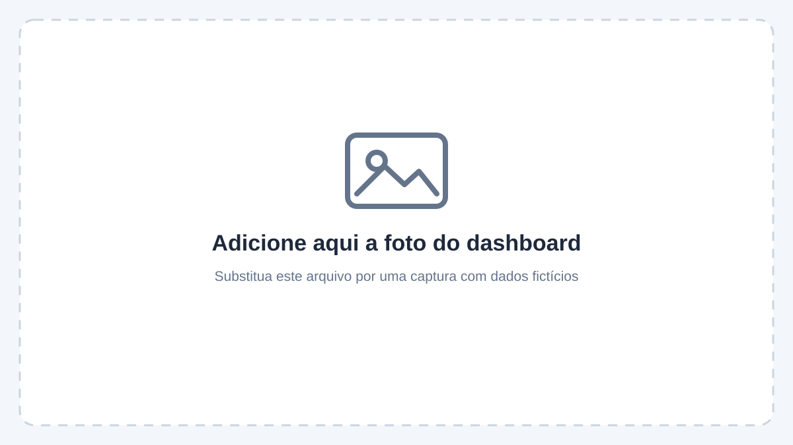

# Bling → Cloudflare Workers → Power BI

Painel de **contas a pagar** integrado diretamente ao ERP Bling — uma alternativa à planilha atualizada manualmente todos os dias.

<!-- Substitua docs/dashboard-placeholder.svg pela captura do seu dashboard. -->


> **Estado deste repositório:** o material recebido descreve a arquitetura e o funcionamento do projeto, mas não inclui os arquivos-fonte do Worker, do Power Query ou do Power BI. A estrutura está preparada para recebê-los; esses componentes ainda precisam ser adicionados para que a integração possa ser executada.

## Sobre o projeto

Todos os dias, eu atualizava uma planilha com fornecedores, vencimentos, valores, contas em atraso e pagamentos previstos para o dia. Embora funcional, esse processo era manual e os dados podiam ficar desatualizados.

Este projeto automatiza o fluxo **Bling → Power BI**, buscando os dados no ERP, tratando-os em uma API intermediária e apresentando as informações em um dashboard interativo.

## Arquitetura

```text
Bling API v3  →  Cloudflare Worker  →  Power BI
   OAuth2        API intermediária     Power Query + DAX + HTML/CSS
```

| Camada | Responsabilidade |
|---|---|
| **Bling API v3** | Fonte dos dados de contas a pagar, contatos, formas de pagamento, contas contábeis e borderôs. Autenticação via OAuth2. |
| **Cloudflare Worker** | Gerencia a renovação do token, respeita os limites da API, enriquece os registros e retorna dados organizados e paginados. |
| **Cloudflare KV** | Armazena tokens e dados em cache: cadastros por 24 horas e contas já pagas por 7 dias. |
| **Power BI** | Consome o JSON pelo Power Query e monta um dashboard cujo layout em HTML/CSS é gerado por uma medida DAX e responde aos filtros. |

## O que o Worker faz

- `GET /login` e `GET /callback`: inicia e conclui a autorização OAuth2 com o Bling.
- `GET /contas-pagar?pagina=1&limite=30`: lista contas a pagar com dados enriquecidos, incluindo fornecedor, valor, emissão, competência, vencimento, histórico, pagamento, forma de pagamento e conta financeira.
- `GET /token-status` e `GET /refresh`: consulta o estado do token e permite solicitar sua renovação.
- Renova o token automaticamente quando o Bling retorna `401`.
- Tenta novamente chamadas limitadas (`429`) e controla o intervalo entre requisições, respeitando o limite aproximado de três chamadas por segundo.
- Usa cache inteligente: contas em aberto são consultadas novamente; contas pagas são armazenadas após a confirmação do pagamento e removidas do cache se houver mudança de valor, vencimento ou situação.

## O dashboard

O painel apresenta:

- Total a pagar, valores em atraso, vencimentos do dia e contas em aberto dentro do prazo.
- Principais fornecedores.
- Atrasos agrupados por faixa de dias.
- Vencimentos por mês.
- Lista de contas em atraso e próximos vencimentos.
- Filtros por situação e data.

## Desafios e aprendizados

- **Permissões no app do Bling:** sem a permissão de leitura de contatos, o fornecedor não é retornado (erro de escopo `403`). Vale testar cada endpoint antes de construir o painel.
- **Dados distribuídos em vários endpoints:** a listagem principal não contém todos os campos; foi necessário consultar também detalhes, contatos, formas de pagamento, contas contábeis e borderôs, onde está a data de pagamento.
- **Variáveis de ambiente:** um nome incorreto impediu o Worker de localizar as credenciais.
- **Token invalidado:** o Bling mantém um único token ativo por app. Outra ferramenta que use o mesmo app pode invalidar o token do Worker; a renovação automática ajuda a contornar esse cenário.
- **Desempenho:** consultar cada conta individualmente tem custo. O cache de contas pagas reduz o trabalho nas atualizações seguintes, que passam a se concentrar nas contas em aberto.

## Como configurar

1. Crie um app no Bling e habilite os escopos de **leitura** necessários: contas a pagar, contatos, caixas e bancos, contas contábeis e borderôs.
2. Crie um namespace KV na Cloudflare e associe-o ao Worker com o nome `KV`.
3. Configure `BLING_CLIENT_ID` e `BLING_CLIENT_SECRET` como **secrets** do Worker.
4. Faça o deploy do Worker e cadastre a URL da rota `/callback` no app do Bling.
5. Acesse `/login` uma vez para autorizar a integração.
6. No Power BI, use o script `powerquery/contas_pagar.pq`, substitua `SEU-WORKER.workers.dev` pelo endereço do seu Worker e selecione autenticação **Anônimo**.

## Segurança

- Nunca inclua Client ID, Client Secret ou tokens diretamente no código. Armazene-os como secrets.
- Habilite no Bling somente os escopos de leitura necessários.
- **Antes de usar em produção, proteja o endpoint com uma chave de acesso.** Sem essa proteção, uma API pública pode expor dados financeiros a quem tiver o link.
- Remova rotas de diagnóstico antes de publicar.
- Use apenas dados fictícios nas imagens e exemplos publicados neste repositório.

## Próximos passos

- [ ] Adicionar chave de acesso à API.
- [ ] Configurar atualização agendada no Power BI Service.
- [ ] Incluir contas a receber.
- [ ] Criar alerta de vencimentos do dia.

## Estrutura do repositório

```text
├── worker/            reservado ao código do Cloudflare Worker (sem credenciais)
├── powerquery/        reservado ao script M para o Power BI
├── powerbi/           reservado ao tema e às medidas DAX do layout
├── docs/              imagem demonstrativa e documentação
└── README.md
```

> **Para adicionar sua foto:** substitua `docs/dashboard-placeholder.svg` pela sua captura e atualize o link da imagem acima se usar outro nome ou formato. Oculte dados reais de fornecedores, valores e vencimentos antes de publicar.

## Licença

Este projeto está sob a licença [MIT](LICENSE). Antes de publicar, substitua `[NOME DO TITULAR]` no arquivo `LICENSE` pelo nome do titular dos direitos autorais.
